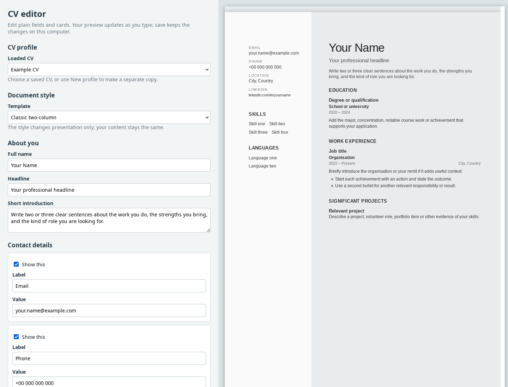
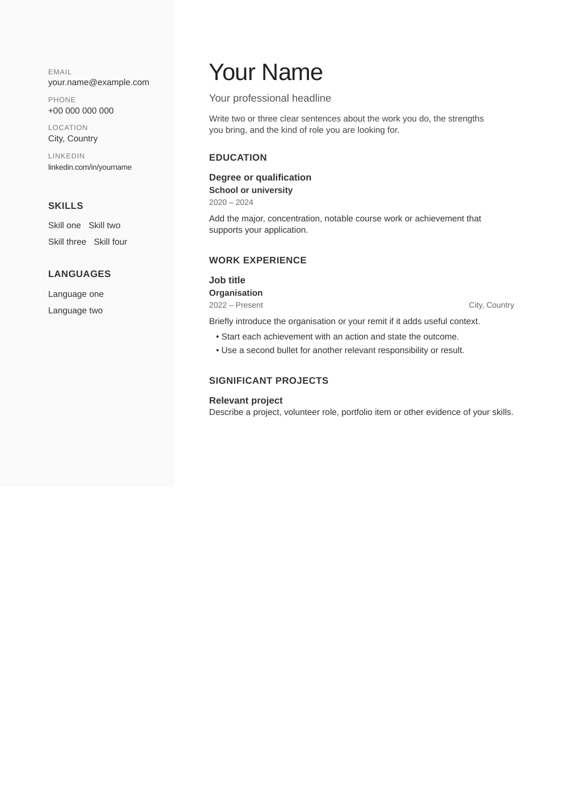
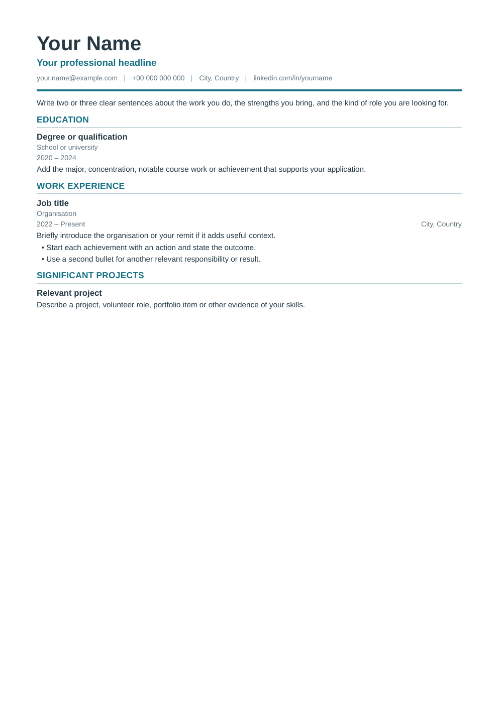

# CV Studio — a stupidly simple little CV generator

CV Studio is a stupidly simple little CV generator for clean, professional CVs.
It runs only on your computer and does not upload your CV anywhere.

## Download and start on Windows

You do **not** need to know Git or use a command line.

1. Open [the latest release](../../releases/latest).
2. Under **Assets**, download `cv-studio-windows.zip`.
3. Open your Downloads folder, right-click the ZIP file and choose **Extract All**.
4. Open the extracted `cv-studio` folder and read `START-HERE.md`.
5. Follow the one-time Python setup, then double-click `start-windows.bat`.
6. Later, double-click `update-windows.bat` to get the newest version. Your
   own CV files are kept.

If the release ZIP is unavailable, use the green **Code** button on this page and
choose **Download ZIP** instead.

Your CV stays in the folder on your computer. Back up the local profile file as
explained in the guide.

## Screenshots

### Editor



### Classic two-column template



### Modern single-column template



The editor presents ordinary fields, repeatable cards and show/hide switches. It
stores portable local JSON documents, then feeds the chosen one to a selected
template. Any `.json` CV dropped into `content/profiles` (for example one that
ChatGPT drafted from the copied example) is picked up while the app runs;
unreadable files are listed with the reason. The data is not tied to a template, so another template can
be added without making the editor user learn markup or CSS.

## Start

For developers, from this directory:

```bash
uv sync
make serve
```

Open <http://127.0.0.1:8765>. Nothing is sent over the network; the server binds
only to the loopback address. Changes save automatically.
The preview updates while editing. **Save as PDF** uses WeasyPrint when it is
installed, otherwise a headless Edge/Chrome print (`--no-pdf-header-footer`),
and only then the browser's print dialog. Set `CV_STUDIO_BROWSER` to point at
a specific browser executable.

```bash
python server.py --render  # render without opening the editor
make test                  # renderer and manifest checks
make e2e                   # browser walkthrough of the editor (needs Node)
```

## Hosted mode (internal service)

The same server runs as a container (`Dockerfile`, published to
`ghcr.io/bayleafwalker/cv-studio` on every `v*` tag). With
`CV_STUDIO_PERSONS=1` it keeps one folder per person under `/data/persons/`;
the browser picks a person once (a cookie remembers it) and agents identify
with a bearer token listed in `/data/tokens.json` as `{"token": "Person"}`.
`GET /api/openapi.json` describes the JSON API for ChatGPT Actions or an MCP
client; `GET /api/schema` returns the example document.

Agents should rather sign in as the person with **OAuth**: set
`CV_STUDIO_OIDC_USERINFO` to the identity provider's userinfo endpoint
(Authentik: `https://auth.example/application/o/userinfo/`). A bearer access
token issued by that provider is looked up there and mapped to the person by
`preferred_username`; the folder is created on first use. To connect a custom
GPT: create an OAuth2 provider + application for CV Studio in Authentik
(confidential client, redirect URI = the callback the GPT editor shows, scopes
`openid profile email`), then in the GPT's Actions use Authentication = OAuth
with Authentik's `authorize/` and `token/` URLs and the client id/secret. Note
that ChatGPT's servers must be able to reach both CV Studio's API and the
identity provider, so both need a public route. A public route must add the
header `X-CV-Studio-Public: 1` (name configurable with `CV_STUDIO_PUBLIC_HEADER`)
and strip client cookies: with that header the server serves only
`/api/openapi.json`, `/api/schema`, `/api/profiles` and `/api/cv`, requires a
bearer token, ignores the person cookie, and answers 404 to everything else
(the editor is never public). Nothing is stored
outside `/data`; PDFs are rendered with WeasyPrint inside the container.

```bash
docker run -p 8080:8080 -v cv-data:/data ghcr.io/bayleafwalker/cv-studio:latest
```

## Structure

- `content/cv.sample.json` — safe starter content committed to Git.
- `content/cv.local.json` — automatically created on the first save and ignored
  by Git. Extra CVs live in `content/profiles/*.json`; the whole `content`
  folder (except the sample) is personal and ignored by Git.
- `templates/` — presentation-only templates: `classic-two-column` (compact
  2018 reference family), `modern-single-column`, and `plain-ats` (no colour,
  no columns, for automated CV parsers). Each manifest declares its page
  margins; the preview uses them to show where pages end.
- `static/` — the editor's HTML, CSS and JavaScript, served by `server.py`.
- `server.py` — local editor, validation, HTML rendering and optional PDF export.
- `update-windows.bat` / `update-windows.ps1` — fetch the latest release ZIP
  over the installed files, keeping `content`.
- `.github/workflows/release.yml` — pushing a `vX.Y.Z` tag that matches
  `pyproject.toml` builds `cv-studio-windows.zip` (`make dist`) and publishes
  the release the updater downloads.
- `REQUIREMENTS.md` — product boundary and acceptance criteria.

To make a second visual template, add a renderer to `TEMPLATES` in `server.py`.
It receives the same normalised data, so content and UI stay unchanged.
